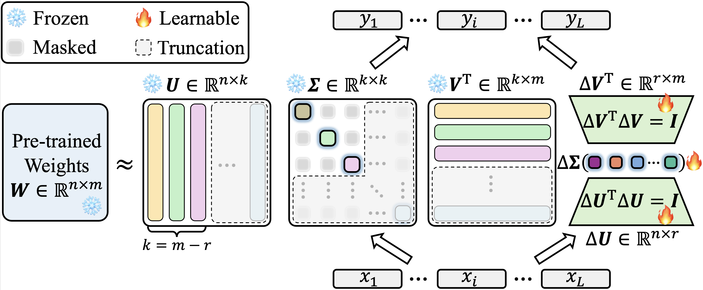

# KaSA: Knowledge-Aware Singular-Value Adaptation of Large Language Models

<p align="center"><a href="https://huggingface.co/llama-duo">[High-Quality Synthetic Instruction-Following Datasets Generated by GPT4o on 🤗]</a> 
</p>
<p align="center" width="100%">

</p>

We implement our KaSA upon LoRA in the official [Hugging Face's PEFT](https://github.com/huggingface/peft) repository. The source code for our KaSA implementation can be found at [peft/src/peft/tuners/lora/layer.py](./peft/src/peft/tuners/lora/layer.py).
It is worth noting that our implementation is version-agnostic regarding PEFT. We achieve consistent results between the latest (0.13.1.dev0) and older (0.6.3.dev0) versions, thus avoiding gains due to differences in implementation.

> [!IMPORTANT]
> 
> If you use the data or code in this repo, please consider citing the following paper: 

```BibTex
@article{wang2024kasa,
  title={KaSA: Knowledge-Aware Singular-Value Adaptation of Large Language Models},
  author={Wang, Fan and Jiang, Juyong and Park, Chansung and Kim, Sunghun and Tang, Jing},
  journal={arXiv preprint arXiv:2412.06071},
  year={2024}
}
```

## Environment
```bash
conda create -n kasa python=3.10
conda install pytorch==2.1.0 torchvision==0.16.0 torchaudio==2.1.0 pytorch-cuda=11.8 -c pytorch -c nvidia
# install peft with local folder
cd peft
pip install -e .
# note the version of packages
pip install datasets==2.21.0
pip install numpy==1.26.4
pip install scipy 
pip install scikit-learn
pip install sentencepiece
```

## PEFT
Fine-tuning the HuggingFace community models for sequence classification on the [General Language Understanding Evaluation](https://gluebenchmark.com/) (GLUE) benchmark involves working with 6 different tasks, including CoLA, SST-2, MRPC, STS-B, QNLI, and RTE. The details of the dataset can be found at [https://huggingface.co/datasets/nyu-mll/glue](https://huggingface.co/datasets/nyu-mll/glue).

Here is an example of how to start fine-tuning RoBERTa Base with the CoLA task:

```
cd runs
bash robert_base_cola.sh
```

where the contents of `robert_base_cola.sh` is delineated in the following:

```bash
#!/bin/bash
cd ../
mkdir -p logs/roberta-base

# variables
CUDA_DEVICE=2

MODEL_NAME_OR_PATH="roberta-base"

DATASET="cola"
TASK="cola"

BATCH_SIZE=32
MAX_LENGTH=512
NUM_EPOCH=100

HEAD_LR=4e-4
MODULE_LR=4e-4 

LORA_R=8
LORA_ALPHA=16
LORA_DROPOUT=0.0

BETA=0.0001
GEMMA=0.001

SEED=0
WEIGHT_DECAY=0.0

# run
LOG_FILE="logs/${MODEL_NAME_OR_PATH}/${MODEL_NAME_OR_PATH}_${TASK}_bs_${BATCH_SIZE}_maxlen_${MAX_LENGTH}_lora_r_${LORA_R}_lora_alpha_${LORA_ALPHA}_lora_dropout_${LORA_DROPOUT}_modulelr_${MODULE_LR}_headlr_${HEAD_LR}_beta_${BETA}_gemma_${GEMMA}_weight_decay_${WEIGHT_DECAY}_seed_${SEED}.log"
CUDA_VISIBLE_DEVICES=$CUDA_DEVICE python main.py \
    --model_name_or_path $MODEL_NAME_OR_PATH \
    --dataset $DATASET \
    --task $TASK \
    --max_length $MAX_LENGTH \
    --bs $BATCH_SIZE \
    --lora_r $LORA_R \
    --lora_alpha $LORA_ALPHA \
    --lora_dropout $LORA_DROPOUT \
    --num_epoch $NUM_EPOCH \
    --head_lr $HEAD_LR \
    --module_lr $MODULE_LR \
    --beta $BETA \
    --gemma $GEMMA \
    --weight_decay $WEIGHT_DECAY \
    --seed $SEED 2>&1 | tee $LOG_FILE
```

To load a PEFT model for inference:

```python
from peft import AutoPeftModelForCausalLM
from transformers import AutoTokenizer
import torch

model = AutoPeftModelForCausalLM.from_pretrained("saves/kasa/checkpoint-52580").to("cuda")
tokenizer = AutoTokenizer.from_pretrained("saves/kasa/checkpoint-52580")

model.eval()

template = "### Context : {}\n### Completion : "
prompt = template.format("name : Blue Spice | Type : coffee shop | area : city centre")
inputs = tokenizer(prompt, return_tensors="pt")

outputs = model.generate(input_ids=inputs["input_ids"].to("cuda"), max_new_tokens=50)
print(tokenizer.batch_decode(outputs, skip_special_tokens=True)[0])

> "Blue Spice is a coffee shop located in the city centre."
```

## Running Logs and Results

> [!TIP]
> The running logs and results of all our experiments are saved in the [<span style="color:red">logs</span>](./logs/) path. The following is an example.

```bash
epoch 0: {'matthews_correlation': 0.0} , current_best_corr: 0.0 train_loss: 0.508760929107666
epoch 1: {'matthews_correlation': 0.4213272367274183} , current_best_corr: 0.4213272367274183 train_loss: 0.28423798084259033
epoch 2: {'matthews_correlation': 0.5234928415614652} , current_best_corr: 0.5234928415614652 train_loss: 0.3484842777252197
...
epoch 96: {'matthews_correlation': 0.630705998012026} , current_best_corr: 0.6610849932923822 train_loss: 0.15325134992599487
epoch 97: {'matthews_correlation': 0.6306644810568987} , current_best_corr: 0.6610849932923822 train_loss: 0.05813060328364372
epoch 98: {'matthews_correlation': 0.6356176940747067} , current_best_corr: 0.6610849932923822 train_loss: 0.05737119913101196
epoch 99: {'matthews_correlation': 0.6356176940747067} , current_best_corr: 0.6610849932923822 train_loss: 0.05779136344790459
```

```bash
model_name_or_path: roberta-base
dataset: cola
task: cola
peft: kasa
num_epochs: 100
bs: 32
lora_r: 8
lora_alpha: 16
lora_dropout: 0.0
head_lr: 0.0004
module_lr: 0.0004
max_length: 512
weight_decay: 0.0
warmup_ratio: 0.06
seed: 0
beta: 0.0001
gemma: 0.001
...
  0%|          | 0/33 [00:00<?, ?it/s]
 15%|█▌        | 5/33 [00:00<00:00, 43.66it/s]
 30%|███       | 10/33 [00:00<00:00, 45.00it/s]
 45%|████▌     | 15/33 [00:00<00:00, 43.80it/s]
 61%|██████    | 20/33 [00:00<00:00, 42.54it/s]
 76%|███████▌  | 25/33 [00:00<00:00, 40.27it/s]
 91%|█████████ | 30/33 [00:00<00:00, 42.00it/s]
100%|██████████| 33/33 [00:00<00:00, 43.15it/s]
epoch 99: {'matthews_correlation': 0.6356176940747067} , current_best_corr: 0.6610849932923822 train_loss: 0.05779136344790459
```


## Useful Tools and Resources
### Source Code
- loralib: [https://github.com/microsoft/LoRA](https://github.com/microsoft/LoRA)
- PEFT: [https://github.com/huggingface/peft](https://github.com/huggingface/peft)
- The Alignment Handbook: [https://github.com/huggingface/alignment-handbook](https://github.com/huggingface/alignment-handbook)
- LLaMA-Factory: [https://github.com/hiyouga/LLaMA-Factory](https://github.com/hiyouga/LLaMA-Factory)
- LLM-Adapters: [https://github.com/AGI-Edgerunners/LLM-Adapters](https://github.com/AGI-Edgerunners/LLM-Adapters)
- LlamaDuo: [https://github.com/deep-diver/llamaduo](https://github.com/deep-diver/llamaduo)

### Benchmarks
- GLUE Benchmark: [https://huggingface.co/datasets/nyu-mll/glue](https://huggingface.co/datasets/nyu-mll/glue)
- E2E Benchmark: [https://huggingface.co/datasets/kibru/e2e](https://huggingface.co/datasets/kibru/e2e)
- Instruction Tuning Alpaca-Cleaned: [https://huggingface.co/datasets/yahma/alpaca-cleaned](https://huggingface.co/datasets/yahma/alpaca-cleaned)

### Evaluation
- NLG Evaluation: [https://github.com/microsoft/LoRA/blob/main/examples/NLG/eval](https://github.com/microsoft/LoRA/blob/main/examples/NLG/eval)
- LLM as Judge: [https://github.com/lm-sys/FastChat/tree/main/fastchat/llm_judge](https://github.com/lm-sys/FastChat/tree/main/fastchat/llm_judge)
- Language Model Evaluation Harness: [https://github.com/EleutherAI/lm-evaluation-harness](https://github.com/EleutherAI/lm-evaluation-harness)
